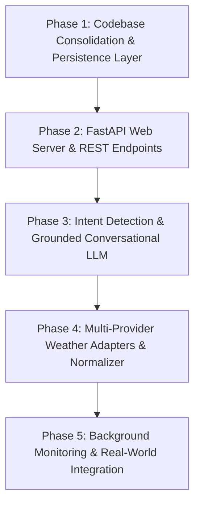

# WeatherGPT: Comprehensive Backend Architecture & Repository Analysis

**Project Name:** WeatherGPT (Smart India Hackathon - SIH)  
**Role:** Backend Architecture & Analysis  
**Repository Path:** `/Users/shubhamsharma/Documents/GitHub/WeatherGPT`  
**Date of Analysis:** September 2026  
**Document Status:** Complete & Frozen for Review  

---

## Executive Summary

WeatherGPT is an agentic AI-powered agricultural weather intelligence and disaster management platform designed for the Smart India Hackathon (SIH). Its goal is to protect farmers by detecting weather anomalies early, evaluating agronomic risk across specific crops and soils, adjusting farm schedules (irrigation, spraying, fertilizing, harvesting), and communicating actionable guidance in local languages.

This analysis provides a complete audit of the repository, compares the current state with the target architecture, evaluates the critical design rule preventing LLM hallucinations, and presents an actionable, phased backend implementation plan.

---

## 1. Complete Project Structure

### Current State of `main` Branch vs. Feature Branches

A critical finding of this repository audit is the divergence between the local `main` branch and the remote feature branches:

1. **`main` Branch (Local Working Tree):**
   - The `main` branch holds the initial scaffolding commit (`50fe624: Create initial WeatherGPT project structure`).
   - Almost all files on `main` (such as `main.py`, `requirements.txt`, `.env.example`, `docs/agent_contracts.md`, and all agent modules) are **0-byte empty placeholders**.
2. **Feature Branches (`origin/feature/*`):**
   - Significant development has occurred across four feature branches:
     - `origin/feature/strategist`
     - `origin/feature/orchestrator`
     - `origin/feature/executor`
     - `origin/feature/sentinel`
   - **`origin/feature/sentinel` represents the accumulated work of all branches**, containing **34 files and 6,387 lines of code**. It builds directly on `executor`, which builds on `orchestrator`, which builds on `strategist`.

### Directory Tree & Purpose (from `origin/feature/sentinel`)

```text
WeatherGPT/
├── .env.example                     # Environment variable template
├── .gitignore                       # Git ignore rules for Python, caches, env
├── README.md                        # Project title and description
├── requirements.txt                 # Core Python package dependencies
├── main.py                          # CLI runner executing LangGraph workflow
│
├── config/
│   ├── __init__.py
│   └── settings.py                  # Typed Pydantic Settings container & .env loader
│
├── docs/
│   └── agent_contracts.md           # Inter-agent JSON schemas & communication contracts
│
├── agents/                          # Autonomous Agent Implementations
│   ├── __init__.py
│   ├── orchestrator/                # LangGraph Workflow Bus & State Machine
│   │   ├── __init__.py
│   │   ├── graph.py                 # StateGraph definition (START -> Sentinel -> Strategist -> Executor -> END)
│   │   ├── nodes.py                 # Execution wrapper nodes & fallback rule detector
│   │   ├── router.py                # Conditional edge routing (threat vs. monitor/END)
│   │   └── state.py                 # TypedDict 'WeatherState' shared bus
│   ├── sentinel/                    # Member 2: Weather Ingestion & Threat Detection
│   │   ├── __init__.py
│   │   ├── agent.py                 # SentinelAgent class, mock scenarios, multi-model consensus
│   │   ├── detector.py              # ThreatDetector: Deterministic threshold math for 7 hazard types
│   │   └── schemas.py               # Pydantic schemas: ThreatEvent, ModelForecastData, MultiModelComparison
│   ├── strategist/                  # Member 3: Agricultural Decision & Agronomic Risk Engine
│   │   ├── __init__.py
│   │   ├── agent.py                 # StrategistAgent: Coordinates risk evaluation, explanations & Q&A
│   │   ├── risk_engine.py           # RiskEngine: Dynamic soil drying days, crop stage sensitivity matrices
│   │   └── schemas.py               # Pydantic schemas: FarmerProfile, FarmActivity, FarmerAssessment
│   ├── executor/                    # Action & Synchronization Layer
│   │   ├── __init__.py
│   │   ├── agent.py                 # ExecutorAgent: Processes ActionItems, updates DB & Calendar
│   │   ├── dispatcher.py            # AlertDispatcher & IdempotencyManager (SMS, voice queue, telemetry)
│   │   └── schemas.py               # Pydantic schemas: ExecutorOutput, DispatchedAlert, CalendarOperation
│   └── radio_gpt/                   # Member 4: Voice synthesis placeholder
│       └── __init__.py
│
├── tools/                           # External Tools & Utilities
│   ├── weather/
│   │   ├── __init__.py
│   │   └── weather_api.py           # Open-Meteo Geocoding and Forecast API client
│   ├── farmer/
│   │   ├── __init__.py
│   │   └── farmer_db.py             # In-memory farmer profiles data store & queries
│   ├── calendar/                    # Google Calendar & Mock Calendar integration
│   │   ├── __init__.py
│   │   ├── base.py                  # Abstract Base Class 'CalendarProvider' & 'CalendarEvent'
│   │   ├── google_calendar.py       # Live Google Calendar API integration via service account
│   │   └── mock_calendar.py         # In-memory calendar simulator for testing
│   ├── maps/                        # Geospatial mapping utilities placeholder
│   │   └── __init__.py
│   └── notifications/               # Outbound messaging placeholder
│       └── __init__.py
│
├── backend/                         # Web Server placeholder (.gitkeep only)
├── database/                        # Database migrations/scripts placeholder (.gitkeep only)
├── frontend/                        # Web Dashboard placeholder (.gitkeep only)
├── models/                          # Machine learning models placeholder (.gitkeep only)
│
└── tests/                           # Unit & Integration Test Suite
    ├── test_settings.py             # Configuration & environment variable tests
    ├── test_sentinel.py             # Threat detector & Sentinel agent tests
    ├── test_strategist.py           # Risk engine, crop matrices & drying formula tests
    ├── test_orchestrator.py         # LangGraph router & node integration tests
    ├── test_calendar_integration.py # Calendar synchronization tests
    └── test_integration.py          # End-to-end multi-scenario integration tests
```

---

## 2. Existing Frontend Technology & Files

- **Frontend Technology:** None.
- **Frontend Files:** Only `frontend/.gitkeep` exists.
- **Observations:**
  - There are no HTML, CSS, JavaScript, React, Vue, Next.js, or Vite files anywhere in the Git history.
  - However, the backend code produces structured payloads specifically tailored for a dashboard (e.g., `FarmerAssessment.dashboard_summary`, `DashboardEvent`, color-coded status badges `"green"`, `"yellow"`, `"orange"`, `"red"`).
  - The frontend is expected to connect to the backend as Member 5 of the SIH architecture.

---

## 3. Existing Backend Files & Backend Technology

- **Backend Directory (`backend/`):** Contains only `.gitkeep`. There is no web server (FastAPI, Flask, Django, or Express) implemented inside `backend/`.
- **Existing Backend Logic Location:** All active backend code currently resides in `agents/`, `tools/`, `config/`, and `main.py`.
- **Core Technologies Used:**
  - **Python 3.10+**
  - **LangGraph (`langgraph>=0.2.0`):** Used as the core state-machine orchestrator controlling execution flow across agents.
  - **LangChain Core (`langchain-core>=0.3.0`):** Base types and graph primitives.
  - **Pydantic v2 (`pydantic>=2.0.0`):** Strict data validation, schema enforcement, and JSON serialization.
  - **python-dotenv (`python-dotenv>=1.0.0`):** Environment management.
  - **Requests (`requests`):** HTTP client for fetching Open-Meteo REST APIs.
  - **Google API Client (`google-api-python-client`, `google-auth`):** Interacting with Google Calendar API.
- **Execution Mechanism:** Currently, backend execution is triggered exclusively via the CLI command `python main.py`, which initializes an in-memory dictionary `{"location": "Jalandhar"}`, executes the compiled LangGraph workflow, and prints console telemetry.

---

## 4. Existing API Integrations

1. **Open-Meteo Geocoding API (`https://geocoding-api.open-meteo.com/v1/search`):**
   - Resolves location names (e.g., "Jalandhar", "Bathinda") into latitude, longitude, country, and admin hierarchy.
   - Handled in `tools/weather/weather_api.py`.
2. **Open-Meteo Forecast API (`https://api.open-meteo.com/v1/forecast`):**
   - Queries current and 12-hour forecast parameters: `temperature_2m`, `relative_humidity_2m`, `precipitation`, `rain`, `showers`, `weather_code`, `wind_speed_10m`, `wind_gusts_10m`.
   - Handled in `tools/weather/weather_api.py` and `agents/sentinel/agent.py`.
3. **Google Calendar API (`tools/calendar/google_calendar.py`):**
   - Synchronizes farm schedule changes with real Google Calendar events.
   - Authenticates using Google Service Account credentials (`GOOGLE_APPLICATION_CREDENTIALS`).
4. **Conversational / LLM API:**
   - Mentioned in configuration (`GEMINI_API_KEY`), but **not yet wired up**. No live API calls to Google Gemini or OpenAI exist in the codebase.
5. **Telephony / SMS API:**
   - Outbound SMS and voice alerts are simulated and queued in memory via `AlertDispatcher` in `agents/executor/dispatcher.py`. No live Twilio, Gupshup, or Fast2SMS integration is active.

---

## 5. Existing Weather API / Provider Integrations

1. **Live Weather Source:**
   - Open-Meteo is the single live provider implemented.
2. **Offline Hackathon Demo Scenarios (`agents/sentinel/agent.py`):**
   - Pre-calibrated deterministic scenarios for stable live SIH demonstrations:
     - `heavy_rain`: Jalandhar (60 mm cumulative rainfall, high wind gusts).
     - `high_wind`: Bathinda (35 km/h winds, spray drift danger).
     - `extreme_heat`: Amritsar (44°C peak temperature, thermal distress).
     - `frost`: Karnal (3°C ground temperature, foliage damage).
3. **Multi-Model Consensus & Verification:**
   - The system schema defines multi-model consensus across **ECMWF-IFS**, **GFS-Global**, and **ICON-EU**.
   - Current implementation: `verify_multi_model_consensus` calculates realistic mathematical variance bands around the base weather data rather than firing three distinct parallel API requests.
4. **Missing Weather Providers:**
   - IMD (India Meteorological Department) API / Mausam data (vital for Indian agricultural authority).
   - Additional secondary global providers (e.g., OpenWeatherMap, Tomorrow.io, ECMWF direct).

---

## 6. Existing Database Configuration & Models

- **Database Directory (`database/`):** Contains only `.gitkeep`.
- **Models Directory (`models/`):** Contains only `.gitkeep`.
- **Current Data Store (`tools/farmer/farmer_db.py`):**
  - An in-memory Python class `FarmerDB`.
  - Initialized with 5 realistic seed farmer profiles located across Punjab (Jalandhar, Bathinda, Amritsar, Ludhiana).
  - Stores: `farmer_id`, `name`, `phone`, `language` (pa, hi, en), `location`, `crop`, `crop_stage`, `soil_type`, `irrigation_method`, and `current_plan` (list of `FarmActivity`).
  - Supports CRUD methods: `get_farmer_by_id`, `get_farmers_by_location`, `update_farmer_plan`, `add_farmer`.
- **Gaps in Persistence:**
  - Data resets whenever the Python process terminates.
  - No relational database (SQLite, PostgreSQL) or ORM (SQLAlchemy, SQLModel) is configured.
  - `.env.example` lists `DATABASE_URL=sqlite:///./weathergpt.db` (tagged as "Member 6"), but the code does not connect to it.

---

## 7. Existing AI / LLM Integration

- **LangGraph Framework:** Used for deterministic agent execution and control flow.
- **LLM API Calls:** **0 (Zero)** LLM calls exist in the current codebase.
- **Current Conversational Q&A (`agents/strategist/agent.py`):**
  - Method `answer_farmer_query(farmer_id, query)` handles questions like *"Why did you postpone my irrigation?"*.
  - It uses deterministic Python keyword matching (`["irrigation", "water", "sinchai", "paani"]`) and returns pre-formatted explanatory text.
- **Multilingual Script Generation (`agents/strategist/agent.py`):**
  - Generated using string interpolation templates for English, Hindi, and Punjabi rather than generative LLM calls.
- **Status Against Goal:** This provides a reliable starting point, but lacks natural dialogue flexibility. A controlled LLM layer (Gemini) needs to be integrated with strict grounding guardrails.

---

## 8. Existing Authentication

- **User/Farmer Authentication:** None. There is no user registration, password hashing, JWT token authentication, or session tracking.
- **Machine/Service Authentication:**
  - Google Calendar Service Account credentials loaded via file path from `GOOGLE_APPLICATION_CREDENTIALS`.

---

## 9. Existing Environment & Configuration Files

1. **`.env.example`:**
   - Complete configuration template specifying:
     - `WEATHER_MODE`: `mock` (SIH presets) or `live` (Open-Meteo).
     - `CALENDAR_PROVIDER`: `mock` or `google`.
     - `DEFAULT_LOCATION`: `Jalandhar`.
     - `LOG_LEVEL`: `INFO`.
     - Hazard thresholds: `RAIN_CRITICAL_MM`, `WIND_SPRAY_LIMIT_KMH`, `HEAT_STRESS_C`, `FROST_HIGH_C`.
     - Credentials: `GOOGLE_APPLICATION_CREDENTIALS`, `GOOGLE_CALENDAR_ID`, `DATABASE_URL`, `GEMINI_API_KEY`.
2. **`config/settings.py`:**
   - Fully implemented, typed Pydantic configuration class (`Settings`).
   - Includes a custom zero-dependency `.env` reader that loads key-value pairs directly into `os.environ`.
   - Organizes settings into structured sub-models: `SystemExecutionSettings`, `AgronomicHazardThresholds`, `WeatherApiSettings`, and `IntegrationCredentials`.

---

## 10. Existing Deployment Configuration

- **Docker:** No `Dockerfile` or `docker-compose.yml`.
- **CI/CD:** No `.github/workflows/` CI automation.
- **Hosting/Cloud:** No deployment scripts or Procfile for cloud platforms (GCP Cloud Run, Render, Railway, AWS).

---

## 11. Existing Dependencies

- **`requirements.txt` on `origin/feature/sentinel`:**
  ```text
  langgraph>=0.2.0
  langchain-core>=0.3.0
  pydantic>=2.0.0
  python-dotenv>=1.0.0
  ```
- **Dependencies used in code but undeclared in `requirements.txt`:**
  - `requests` (used in `tools/weather/weather_api.py`)
  - `google-api-python-client`, `google-auth`, `google-auth-oauthlib` (used in `tools/calendar/google_calendar.py`)
  - `pytest` (used in `tests/test_settings.py`)

---

## 12. Existing Git Branches & Work History

```text
* 04d9837 (origin/feature/sentinel) feat(config): add typed settings system, .env.example template, and wire into Sentinel agent
* 049ba52 Update agent contracts doc: remove Radio-GPT, add Executor contract and re-observation schedule
* 4fae491 Add Scenario 5 to test_integration.py verifying un-mocked real Sentinel pipeline
* e4c2324 Enhance main.py to display Executor dispatch telemetry in end-to-end run
* 8ac9651 Implement modular Sentinel Agent with multi-source consensus, confidence engine, and unit tests
* bc2e585 (origin/feature/executor) Integrate live Sentinel weather detection
* 9c6a2ff Add Executor and Calendar integration
* 7f0b818 (origin/feature/orchestrator) Integrate Strategist Agent with Orchestrator
* 590c6f1 Ignore Python cache files
* 858c21d Implement initial agent orchestration workflow
| * c17309b (origin/feature/strategist) Enhance Strategist module with multilingual voice scripts, disease modeling, and farmer Q&A
| * 40e0c03 Implement Strategist Agent module with agronomic risk engine and agent contracts
|/  
* 50fe624 (HEAD -> main, origin/main) Create initial WeatherGPT project structure
* e186d6e Initial commit
```

**Key Takeaway:** All the feature work from `strategist`, `orchestrator`, and `executor` has been sequentially integrated into `origin/feature/sentinel`. Merging or bringing `origin/feature/sentinel` into `main` captures 100% of the developed logic.

---

## 13. Backend Functionality Already Implemented

1. **Hazard Detection Engine (`ThreatDetector`):**
   - High-precision threshold classification for 7 weather hazards: Cyclone, Hail, Heavy Rain, High Wind, Extreme Heat, Frost, Drought.
   - Calculates time to onset (`time_to_event_minutes`) and expected event duration (`duration_hours`).
2. **Agronomic Risk Engine (`RiskEngine`):**
   - **Dynamic Soil Hydrology Formula:**
     $$\text{Drying Days} = \max\left(2, \min\left(10, \text{round}\left(\frac{\text{Rainfall (mm)}}{12.0} \times \text{Soil Factor}\right)\right)\right)$$
     (Soil factors: Clay = 1.5, Black Soil = 1.4, Silty = 1.1, Loamy = 1.0, Sandy = 0.5).
   - **Crop Sensitivity Matrix:** Specific stage multipliers for Wheat, Rice, Cotton, Tomato, Potato, Mustard, Maize across Sowing, Vegetative, Flowering, Grain Filling, Maturity, Harvesting.
   - **Operational Conflict Detection:** Flags risks like pollen wash during flowering, nitrogen fertilizer leaching during rain, chemical drift during high winds (>15 km/h), and tuber rot in wet soil.
3. **Autonomous Replanning Engine:**
   - Automatically reschedules conflicting farm activities (`postpone_irrigation`, `reschedule_spray`, `delay_fertilization`, `drainage_preparation`).
4. **Execution & Calendar Synchronization:**
   - Syncs rescheduled activities with Google Calendar or Mock Calendar.
   - Generates audit receipts (`ExecutorOutput`).
5. **Multi-Channel Alert Dispatcher:**
   - Idempotency manager prevents duplicate alerts on re-runs.
   - Generates localized SMS text in English, Hindi, and Punjabi.
6. **LangGraph State Graph:**
   - Compiles state machine with conditional routing (`sentinel` -> `strategist` if threat, else `END`).
7. **Automated Test Suite:**
   - 6 test files covering unit, integration, and mock scenarios.

---

## 14. Backend Functionality Missing

1. **HTTP Web API Framework (FastAPI):**
   - No REST API endpoints to serve the frontend (e.g., `/api/chat`, `/api/forecast`, `/api/farmers`, `/api/alerts`, `/api/calendar/events`).
2. **Natural Language Chat & Intent Detection:**
   - No conversation handler to parse user messages (e.g., *"Will it rain tomorrow in Ludhiana?"*, *"Can I spray my wheat field this afternoon?"*).
   - Missing intent classification (weather query vs. farm advisory vs. general conversation).
3. **Grounding & Guardrailed LLM Response Generator:**
   - No Gemini/LLM integration strictly bounded by deterministic backend facts.
4. **Persistent Database Layer (SQLite/PostgreSQL):**
   - Missing SQLAlchemy or SQLModel database models for permanent storage of farmers, activity plans, alert history, and chat messages.
5. **Real-time Multi-Provider Weather Ingestion:**
   - Only Open-Meteo is currently fetched; lacks true parallel multi-source ingestion (IMD, secondary providers) and real multi-model comparison.
6. **Background Scheduling & Monitoring Loop:**
   - No cron or scheduler (APScheduler / Celery) running continuous background weather monitoring cycles.

---

## Comparison with Intended Architecture

| Architecture Stage | Intended Architecture Requirement | Current Repository Status | Gap / Required Action |
|---|---|---|---|
| **1. User** | Farmer or agricultural officer | N/A (External user) | None |
| **2. Frontend** | Interactive web dashboard & chat interface | Empty (`frontend/.gitkeep`) | Needs frontend development or mock client |
| **3. Chat/Intent Detection** | NLU pipeline: classifies intent, extracts crop, location, date | Missing | Build Intent Detection service (FastAPI + LLM/Regex) |
| **4. Weather Provider Adapters** | Modular adapters for Open-Meteo, IMD, AccuWeather | Only Open-Meteo adapter exists | Create modular adapter interface & add secondary source |
| **5. Common Weather Schema** | Unified weather model across all providers | Partially in `ThreatEvent` and Open-Meteo dict | Define formal `CommonWeatherReport` Pydantic model |
| **6. Normalization/Validation** | Unit conversions, missing value imputation, sanity bounds | Present in `detector.py` and `weather_api.py` | Extract into dedicated `Normalizer` service |
| **7. Multi-source Verification** | Compare multiple model outputs (ECMWF, GFS, ICON) | Simulated variance profile in Sentinel | Connect to actual ensemble endpoints or multi-API |
| **8. Confidence Engine** | Multi-source consensus score & human-readable rationale | Fully implemented in `agents/sentinel/agent.py` | Ready; enhance with real multi-model feed |
| **9. Risk Engine** | Agronomic risk calculations based on crop, stage, soil | Fully implemented in `agents/strategist/risk_engine.py` | Production ready; fully deterministic |
| **10. Recommendation Engine** | Practical farm advice & dynamic schedule adjustments | Fully implemented in `StrategistAgent` & `RiskEngine` | Production ready; dynamic drying days + rescheduling |
| **11. Alert Engine** | Multi-channel, localized notifications with idempotency | Implemented in `agents/executor/dispatcher.py` | Wire to SMS gateway or dashboard notification store |
| **12. Chat Response** | Natural, grounded conversational response in user language | Rule-based keyword matching only | Implement Gemini LLM response generator with strict grounding |

---

## Important Design Rule Verification

> **Design Rule:** The LLM must not invent weather values, risk values, forecasts, or alerts. Numerical weather and risk calculations must come from structured weather data and deterministic or model-based backend logic.

### How the Existing Code Honors This Rule
The existing agentic system strictly respects this design principle:
1. **Weather Values:** Ingested directly from Open-Meteo REST API or pre-calibrated SIH mock datasets. No LLM touches or generates weather numbers.
2. **Threshold & Anomaly Detection:** Handled purely by `ThreatDetector` using Python floating-point comparisons (e.g., `next_three_rain >= 25.0`).
3. **Risk Scores & Levels:** Calculated by `RiskEngine` using mathematical formulas, soil factors (`SOIL_FACTORS`), and growth stage multipliers (`STAGE_SENSITIVITY`).
4. **Rescheduled Dates:** Calculated using dynamic soil drying equations ($\frac{\text{Rainfall}}{12.0} \times \text{Soil Factor}$).
5. **Execution & Calendar Updates:** Executed deterministically by `ExecutorAgent` without LLM mediation.

### How Future LLM Integration Will Comply
When Google Gemini or another LLM is integrated for conversational responses:
- **Architecture Pattern:** *Fact-Constrained Grounded Generation (RAG)*.
- **Workflow:**
  1. Intent classifier identifies the query intent and extracts entities (location, crop).
  2. Deterministic backend executes Sentinel, Strategist, and RiskEngine.
  3. The structured JSON output (`ThreatEvent`, `RiskBreakdown`, `ActionItem`s) is passed into the prompt as the **sole ground-truth context**.
  4. The LLM system prompt strictly forbids introducing numerical facts not present in the context payload:
     ```text
     "You are WeatherGPT Assistant. You must base all weather numbers, risk ratings, 
     and recommendations strictly on the provided JSON context. Never invent temperature, 
     rainfall, wind speeds, or risk scores."
     ```
  5. Pydantic validation ensures the generated response cites the exact verified metrics.

---

## Proposed Phased Backend Implementation Plan

To evolve this repository into a complete, hackathon-winning backend while keeping the beginner developer's learning curve smooth, the implementation should follow five sequential phases:



### Phase 1: Codebase Consolidation & Persistence Layer (Database)
- **Step 1.1:** Merge `origin/feature/sentinel` into `main` so the team works on a unified, up-to-date branch.
- **Step 1.2:** Update `requirements.txt` with missing dependencies (`fastapi`, `uvicorn`, `sqlmodel` or `sqlalchemy`, `requests`, `google-api-python-client`, `google-genai`).
- **Step 1.3:** Implement a persistent SQLite database (`database/` and `models/`) using `SQLModel` or `SQLAlchemy`:
  - `Farmer` table
  - `FarmActivity` table
  - `ThreatEvent` audit log table
  - `AlertLog` table
- **Step 1.4:** Replace the in-memory dictionary in `tools/farmer/farmer_db.py` with database session queries, keeping the same interface methods for backwards compatibility.

### Phase 2: FastAPI Web Server & REST Endpoints
- **Step 2.1:** Create `backend/app.py` or `main.py` initializing a FastAPI app with CORS middleware (allowing the frontend to connect).
- **Step 2.2:** Expose core endpoints:
  - `GET /api/health`: System health check and mode indicator (`mock` vs `live`).
  - `GET /api/weather/current?location=Jalandhar`: Fetches live weather + multi-model consensus.
  - `POST /api/pipeline/run`: Triggers the LangGraph agent pipeline for a given location and returns the complete execution receipt.
  - `GET /api/farmers`: Lists all registered farmers and their active farm plans.
  - `GET /api/farmers/{farmer_id}/dashboard`: Returns color-coded dashboard summary and action cards.
  - `GET /api/alerts`: Returns recent dispatched and queued alerts.

### Phase 3: Natural Language Intent Detection & Grounded Chat Endpoint
- **Step 3.1:** Build `agents/chat/intent.py`:
  - Classifies user message into intents: `WEATHER_CHECK`, `CROP_ADVISORY`, `ACTIVITY_PLAN`, `WHY_REPLAN`, `GENERAL_CHAT`.
  - Extracts entities: `location`, `crop`, `date`, `activity`.
- **Step 3.2:** Build `agents/chat/grounded_chat.py`:
  - Calls Google Gemini API using `google-genai`.
  - Injects structured output from Sentinel and Strategist into system context.
  - Emits localized, sympathetic, highly accurate explanations matching the farmer's language preference.
- **Step 3.3:** Expose `POST /api/chat`:
  - Accepts user query, farmer ID, and language.
  - Runs intent detection -> fetches deterministic data -> formats grounded answer.

### Phase 4: Weather Provider Adapters & Formal Common Schema
- **Step 4.1:** Formalize `CommonWeatherSchema` in `tools/weather/schemas.py`.
- **Step 4.2:** Implement `BaseWeatherAdapter` interface with:
  - `OpenMeteoAdapter`
  - `IMDWeatherAdapter` (or simulated IMD official bulletin parser for Indian states)
- **Step 4.3:** Upgrade Sentinel's consensus engine to compare real multi-source feeds.

### Phase 5: Background Monitoring Loop & External Integrations
- **Step 5.1:** Add background scheduled task runner (using FastAPI background tasks or APScheduler) to poll weather every $N$ hours.
- **Step 5.2:** Connect outbound SMS alerts to an external gateway (Twilio, Gupshup, or webhook).
- **Step 5.3:** Containerize the application with `Dockerfile` and `docker-compose.yml` for seamless deployment.

---

## Conclusion & Next Steps

The repository already possesses strong, well-architected algorithmic foundations in `origin/feature/sentinel`:
- Deterministic hazard detection
- Comprehensive agronomic risk models
- Dynamic soil drying formulas
- LangGraph orchestration
- Multi-channel execution safeguards

By merging the feature branch, standing up a FastAPI layer, establishing database persistence, and layering a grounded LLM conversational endpoint over the existing deterministic calculations, WeatherGPT will fully achieve its target architecture and adhere strictly to its zero-hallucination design rule.
